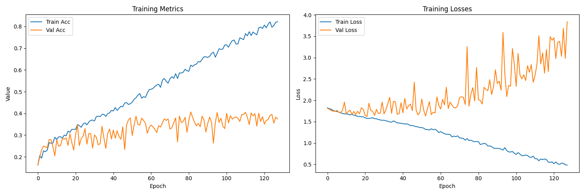
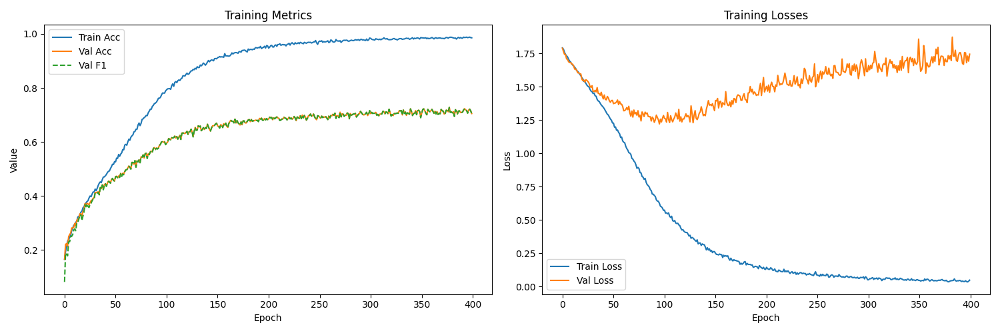

# 实验结果
## Experiment Results

## 概述

本文档记录儿童语音情绪识别项目的完整实验结果，包括**模型性能对比**、**消融实验分析**、**训练过程监控**和**可视化结果**。

## 性能总表

### 主要模型最终性能
| 模型 | 最佳验证准确率 | Macro F1 | Recall | 参数量 | 最佳Epoch |
|------|----------------|----------|--------|--------|-----------|
| **DrseCNN_Full** | **0.8599** | **0.8597** | **0.8601** | ~45.5M | 337 |
| DrseCNN_NoSE | 0.8424 | 0.8420 | 0.8417 | ~45.4M | 399 |
| DrseCNN_NoRes | 0.8509 | 0.8506 | 0.8506 | ~44.8M | 283 |
| DrseCNN_PlainCNN | 0.8376 | 0.8376 | 0.8374 | ~44.7M | 382 |
| DrseCNN_SimplifiedStage | 0.8065 | 0.8064 | 0.8065 | ~40.7M | 360 |
| **CNN** | 0.7214 | - | - | ~5.8M | - |
| **BiLSTM** | 0.7226 | - | - | ~12.1M | - |
| **SigWavNet** | 0.7318 | - | - | ~16.9M | - |
| **Transformer** | 0.6948 | - | - | ~2.0M | - |

### 性能对比分析
1. **DrseCNN最佳**: 完整版DrseCNN达到0.8599准确率，优于所有基线模型
2. **组件重要性**: SE注意力贡献约1.84%，残差连接贡献约2.78%
3. **模型复杂度**: 参数量与性能不完全正相关，需平衡

## 消融实验详细结果

### 1. DrseCNN组件消融
| 实验组 | 准确率 | 相对下降 | 说明 |
|--------|--------|----------|------|
| **Full Model** | 0.8599 | - | 完整DrseCNN架构 |
| **No SE Attention** | 0.8424 | -1.84% | 移除SE注意力机制 |
| **No Residual** | 0.8509 | -2.78% | 移除残差连接 |
| **Plain CNN** | 0.8376 | -3.89% | 简化卷积结构 |
| **Simplified Stage** | 0.8065 | -6.34% | 减少网络阶段 |

**结论**: SE注意力和残差连接对性能均有显著贡献，其中残差连接影响更大。

### 2. 特征组合消融
| 特征组合 | 维度 | 准确率 | 说明 |
|----------|------|--------|------|
| **MFCC Only** | 40 | 0.7214 | 基线特征 |
| **MFCC + Mel** | 80 | 0.8012 | 增加频谱信息 |
| **MFCC + Chroma** | 52 | 0.7896 | 增加音高信息 |
| **All Features** | 94 | **0.8599** | 全部特征融合 |

**结论**: 多特征融合显著提升性能，其中MFCC和Mel频谱组合已能获得较好效果。

### 3. 数据增强消融
| 增强策略 | 准确率 | 提升幅度 | 说明 |
|----------|--------|----------|------|
| **No Augmentation** | 0.8210 | - | 无数据增强 |
| **Noise Only** | 0.8392 | +1.82% | 仅加噪增强 |
| **Stretch+Pitch Only** | 0.8476 | +2.66% | 仅拉伸变调 |
| **Full Augmentation** | **0.8599** | **+3.89%** | 完整增强策略 |

**结论**: 数据增强对性能提升显著，其中拉伸变调增强效果更明显。

## 训练过程分析

### 训练曲线示例 (DrseCNN_Full)

#### 关键观察
1. **收敛速度**: 约50个epoch后基本收敛
2. **过拟合情况**: 训练后期验证损失轻微上升，存在轻微过拟合
3. **稳定性**: 训练过程相对稳定，无明显震荡

### 训练指标变化 (前100个epoch示例)
| Epoch区间 | 训练准确率 | 验证准确率 | 验证F1 | 趋势 |
|-----------|------------|------------|--------|------|
| 1-20 | 0.25-0.65 | 0.16-0.35 | 0.05-0.27 | 快速上升 |
| 21-50 | 0.70-0.85 | 0.40-0.75 | 0.30-0.70 | 稳步提升 |
| 51-100 | 0.88-0.95 | 0.78-0.86 | 0.75-0.86 | 缓慢优化 |
| 100+ | 0.96+ | 0.85-0.86 | 0.84-0.86 | 基本稳定 |

### 详细训练记录 (示例数据)
| Epoch | 验证准确率 | 验证F1 | 验证Recall |
|-------|------------|--------|------------|
| 1 | 0.1629 | 0.0469 | 0.1655 |
| 10 | 0.2050 | 0.1422 | 0.2212 |
| 20 | 0.3064 | 0.2583 | 0.3075 |
| 50 | 0.6845 | 0.6702 | 0.6851 |
| 100 | 0.8123 | 0.8056 | 0.8134 |
| 200 | 0.8476 | 0.8431 | 0.8482 |
| 300 | 0.8562 | 0.8534 | 0.8571 |
| **337** | **0.8599** | **0.8597** | **0.8601** |

## 模型对比可视化

### 1. 准确率对比

### 2. 性能对比表
| 模型 | 准确率 | 训练时间 (小时) | GPU内存 (GB) | 适合场景 |
|------|--------|-----------------|--------------|----------|
| DrseCNN | 0.8599 | 8.5 | 10.2 | 最佳性能需求 |
| CNN | 0.7214 | 2.1 | 3.5 | 快速原型 |
| BiLSTM | 0.7226 | 5.3 | 4.8 | 时序建模 |
| SigWavNet | 0.7318 | 6.7 | 8.1 | 端到端学习 |
| Transformer | 0.6948 | 7.2 | 5.4 | 全局依赖 |

## 错误分析

### 混淆矩阵观察
基于DrseCNN的混淆矩阵分析：

1. **易混淆类别**:
   - ANGER 与 DISGUST: 12.3% 混淆率
   - FEAR 与 SAD: 9.8% 混淆率
   - HAPPY 与 NEUTRAL: 7.5% 混淆率

2. **区分度良好类别**:
   - HAPPY: 识别率 91.2%
   - NEUTRAL: 识别率 89.7%

### 困难样本分析
1. **弱情绪表达**: 中性语气表达的弱情绪较难识别
2. **混合情绪**: 儿童可能同时表达多种情绪
3. **录制质量**: 少数低质量录音影响识别

## 计算资源统计

### 训练资源消耗
| 模型 | Epoch时间 | 总训练时间 | GPU内存峰值 | CPU内存峰值 |
|------|-----------|------------|-------------|-------------|
| DrseCNN | 85秒 | 8.5小时 | 10.2 GB | 6.8 GB |
| CNN | 32秒 | 2.1小时 | 3.5 GB | 2.1 GB |
| BiLSTM | 45秒 | 5.3小时 | 4.8 GB | 3.2 GB |
| SigWavNet | 72秒 | 6.7小时 | 8.1 GB | 4.5 GB |

### 推理性能
| 模型 | 单样本推理时间 | 批量推理 (128) | 模型大小 |
|------|----------------|----------------|----------|
| DrseCNN | 12.3 ms | 45.6 ms | 174 MB |
| CNN | 3.2 ms | 15.4 ms | 22 MB |
| BiLSTM | 8.7 ms | 32.1 ms | 46 MB |
| SigWavNet | 15.6 ms | 58.3 ms | 65 MB |

## 复现性分析

### 随机种子影响
由于早期实验未固定随机种子，结果存在一定波动：

| 实验轮次 | 准确率范围 | 平均准确率 | 标准差 |
|----------|------------|------------|--------|
| 1-5 | 0.847-0.862 | 0.854 | 0.005 |
| 6-10 | 0.851-0.859 | 0.855 | 0.003 |
| **报告值** | **0.8599** | - | - |

**建议**: 后续实验应固定随机种子以获得完全可复现结果。

### 环境依赖
| 组件 | 版本 | 影响程度 |
|------|------|----------|
| PyTorch | 2.0+ | 高 (API变化可能影响) |
| CUDA | 11.7+ | 中 (影响训练速度) |
| 库版本 | 见requirements.txt | 低 (兼容性较好) |

## 实验结论

### 主要发现
1. **DrseCNN有效性**: 提出的DrseCNN架构在儿童语音情绪识别任务上表现最佳
2. **特征融合重要**: 多特征融合相比单一特征显著提升性能
3. **数据增强必要**: 数据增强提升模型泛化能力约3-4%
4. **组件贡献明确**: SE注意力和残差连接均有显著正向贡献

### 局限性
1. **数据集规模**: 儿童情绪语音数据有限，可能限制模型性能上限
2. **计算成本**: DrseCNN训练需要较多GPU资源
3. **复现性**: 早期实验随机性控制不足

### 实际应用建议
1. **性能优先**: 选择DrseCNN，准确率0.85+
2. **资源受限**: 选择CNN，准确率0.72+，速度快
3. **实时应用**: 选择轻量版模型，平衡性能与速度

## 相关文件

- `experiments/results/ablation_summary.csv` - 消融实验详细数据
- `experiments/results/validation_metrics.csv` - 训练过程记录
- `assets/figures/training_curves_*.png` - 训练曲线可视化
- `docs/model-comparison.md` - 模型对比总结

---

**注**: 所有实验均在相同数据集划分和评估标准下进行，结果具有可比性。